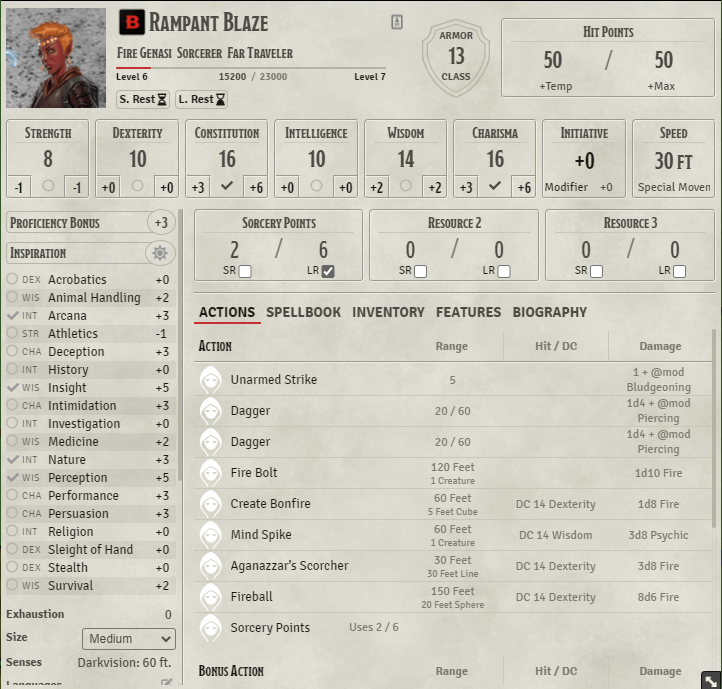
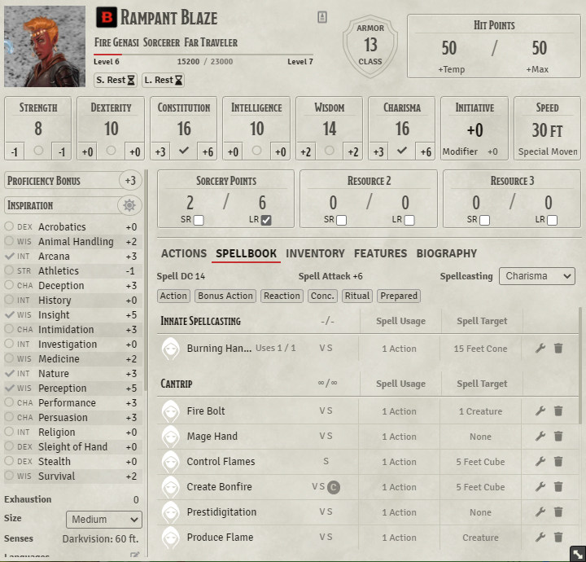
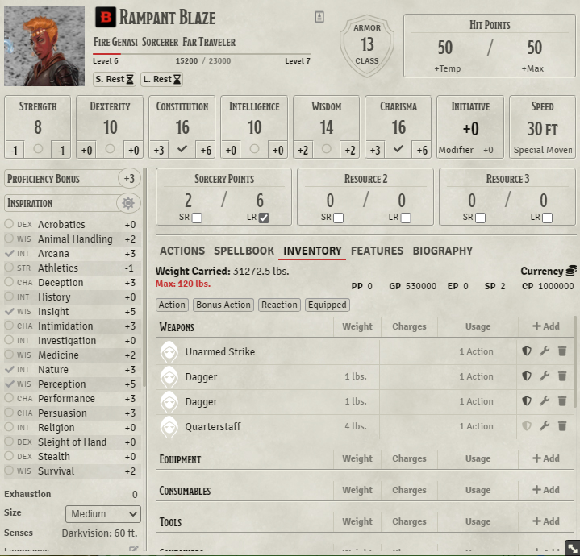
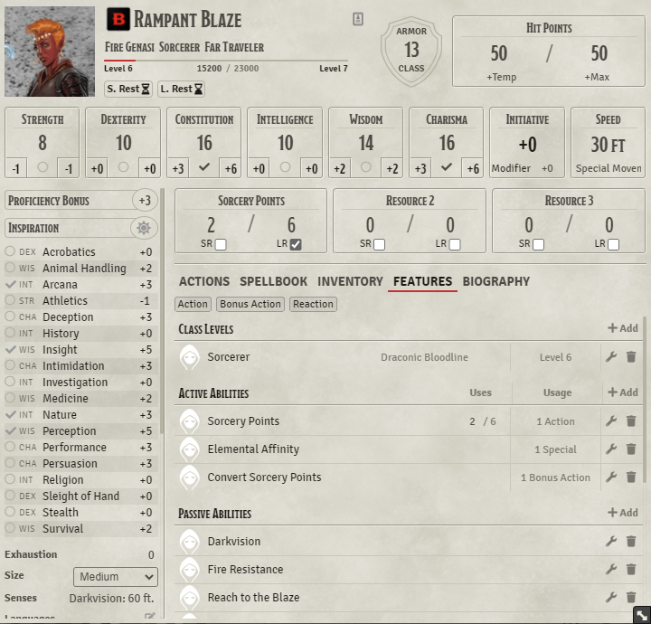
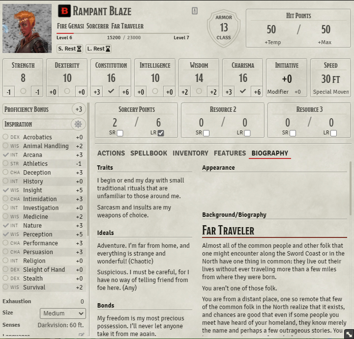

# Compact DnDBeyond-like 5e Character Sheet


Shamlessly taking ideas (and some code) from both the [DnDBeyond character sheet](https://github.com/jopeek/fvtt-dndbeyond-character-sheet) and the [Tidy 5e character sheet](https://github.com/sdenec/tidy5e-sheet). This is an information-dense character sheet for Foundry users who like the feel of D&DBeyond's character sheet, but want it to fit better within the Foundry UI.

## Installation

Module JSON:
```
https://github.com/ElfFriend-DnD/foundryvtt-compactBeyond5eSheet/releases/latest/download/module.json
```

## Gallery
[</img>](readme-img/main-view.png)
[</img>](readme-img/spellbook.png)
[</img>](readme-img/inventory.png)
[</img>](readme-img/features.png)
[</img>](readme-img/biography.png)

Click to view bigger.

## Key Features & Changes

### Actions Tab

Intending to place all of the "combat-important" (damage-dealing) spells and features up front, this tab lists every equipped item and prepared spell that can deal damage. Option in settings to limit spells to only Cantrips.

### Skills and Resources always present

No more digging around through multiple tabs to control your class resources or find the skill list. These two things sit on the screen always.


### Spellbook

Got rid of the spell school to make room for the more compressed table area. I can't think of anyone but a wizard who would need to know this information, and the info is still easily accessible from the expanded row. Make an issue if you disagree and we'll hash things out.


## Options

| **Name**                      | Description                                                                                                                           |
| ----------------------------- | ------------------------------------------------------------------------------------------------------------------------------------- |
| **Limit Actions to Cantrips** | Instead of showing all spells that deal damage in the Actions tab, limit it to only cantrips. This is the default D&DBeyond behavior. |

This sheet respects the 5e System setting: "Disable Experience Tracking"

### Compatibility

I'm honestly not sure how well this will play with modules that affect character sheets, I'll try to test as many as possible but if somethign is obviously breaking please create and issue here and I'll see what I can do.

| **Name**                                                                         | Tested |       Works        | Notes                                                                    |
| -------------------------------------------------------------------------------- | :----: | :----------------: | ------------------------------------------------------------------------ |
| [5e-Sheet Resources Plus](https://github.com/ardittristan/5eSheet-resourcesPlus) |  [x]   | :heavy_check_mark: | Resources area scrolls independently. Uses CSS Grid                      |
| [Variant Encumbrance](https://github.com/VanirDev/VariantEncumbrance)            |  [x]   |        :x:         | Default encumberance bar removed, Speed css overrides will break things. |
| [FoundryVTT Magic Items](https://gitlab.com/riccisi/foundryvtt-magic-items)      |  [x]   |        :x:         | List appended to the end of Spellbook not appending correctly.           |
| [D&D5e Dark Mode](https://github.com/Stryxin/dnd5edark-foundryvtt)               |  [x]   | :heavy_check_mark: | Made tweaks to make foundry-wide dark mode "usable."                     |

## Acknowledgements

Obviously all of the layout decisions here are pretty directly ripped from D&DBeyond's desktop-sized character sheet. I'm assuming they have done a lot of UX research and am piggy-backing off of that work.

Yoinked the expanded Biography tab directly from [tidy5e-sheet](https://github.com/sdenec/tidy5e-sheet). Also took their localization of the headers in said tab.

Bootstrapped with Nick East's [create-foundry-project](https://gitlab.com/foundry-projects/foundry-pc/create-foundry-project).

Mad props to the [League of Extraordinary FoundryVTT Developers](https://forums.forge-vtt.com/c/package-development/11) community which helped me figure out a lot.

## License
This Foundry VTT module, written by Andrew Krigline, is licensed under a Creative Commons Attribution 4.0 International License.

This work is licensed under Foundry Virtual Tabletop EULA - Limited License Agreement for module development v 0.1.6.